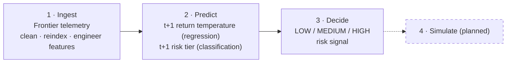
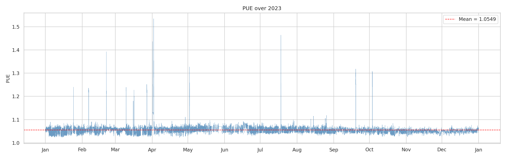
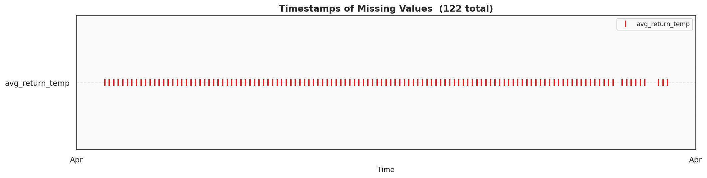
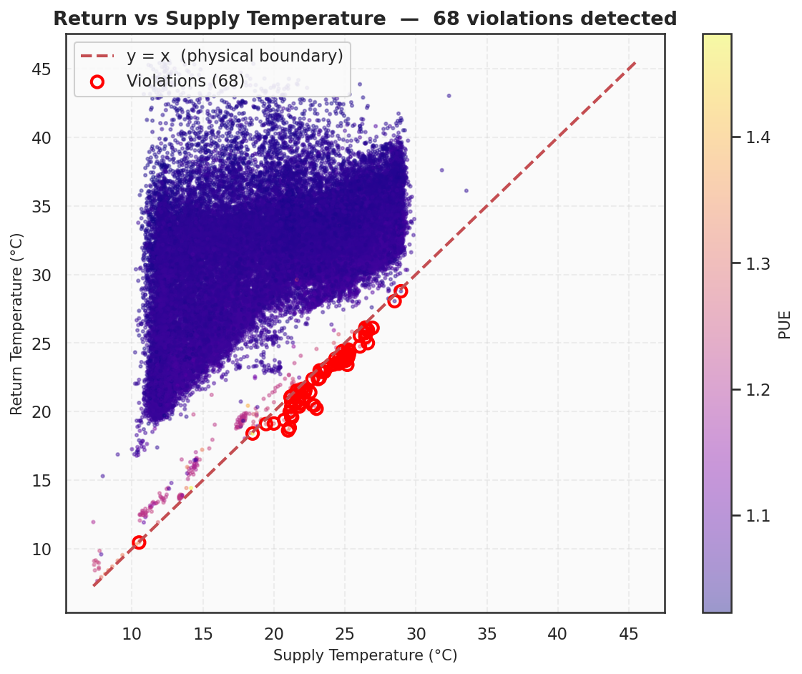
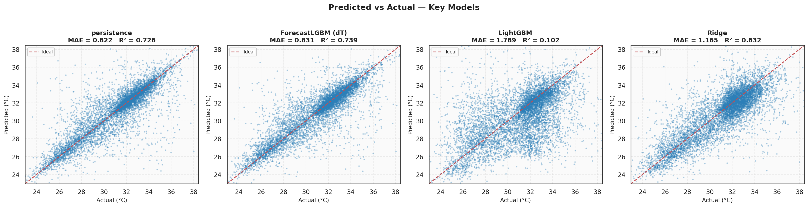
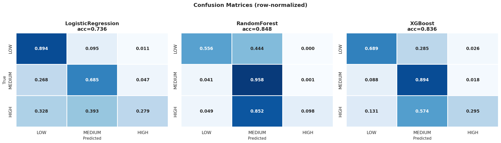
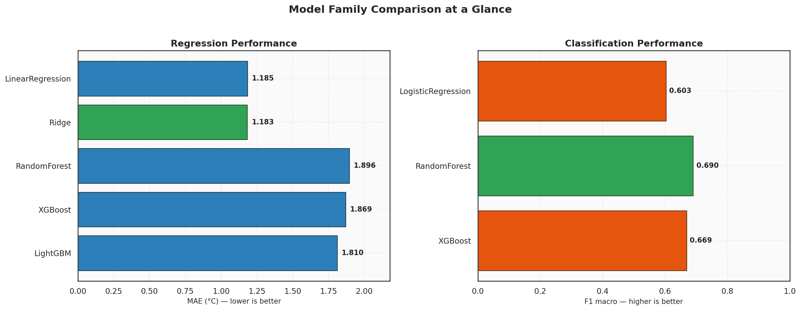

<div align="center">

<h1>COOLANT</h1>

<p><em>Predictive ML for HPC thermal management — forecast cooling demand 10 minutes before it happens.</em></p>

<!-- Row 1: project -->
<p>
  <a href="LICENSE"></a>
  <a href="https://www.python.org/"></a>
  <a href="https://jupyter.org/"></a>
  <a href="https://github.com/psf/black"></a>
  <a href="https://github.com/adityajha1606/coolant-project/pulls"></a>
</p>

<!-- Row 2: research -->
<p>
  <a href="#reference-paper"></a>
  <a href="https://doi.org/10.6084/m9.figshare.24391240.v4"></a>
  <a href="https://doi.org/10.6084/m9.figshare.24391240.v4"></a>
  <!-- Replace with https://zenodo.org/badge/DOI/<your-doi>.svg once the Zenodo DOI is minted -->
  <a href="https://github.com/adityajha1606/coolant-project"></a>
</p>

<!-- Row 3: repository activity -->
<p>
  <a href="https://github.com/adityajha1606/coolant-project/stargazers"></a>
  <a href="https://github.com/adityajha1606/coolant-project/network/members"></a>
  <a href="https://github.com/adityajha1606/coolant-project/commits"></a>
  <a href="https://github.com/adityajha1606/coolant-project/issues"></a>
</p>

<p>
  Coolant forecasts coolant return temperature and classifies thermal risk one step (10 minutes) ahead,<br>
  using real 2023 telemetry from the Frontier exascale supercomputer at Oak Ridge National Laboratory.
</p>

<p>
  <a href="#results">Results</a> ·
  <a href="#the-comparative-insight">Comparative Insight</a> ·
  <a href="#getting-started">Getting Started</a> ·
  <a href="#citation">Citation</a>
</p>

</div>

---

## Table of Contents

- [Table of Contents](#table-of-contents)
- [Overview](#overview)
- [Key Highlights](#key-highlights)
- [Architecture](#architecture)
- [Results](#results)
  - [Regression: return temperature at t+1](#regression-return-temperature-at-t1)
  - [Classification: risk tier at t+1](#classification-risk-tier-at-t1)
- [The Comparative Insight](#the-comparative-insight)
- [Reference Paper](#reference-paper)
- [Repository Structure](#repository-structure)
- [Getting Started](#getting-started)
- [Reproducing Results](#reproducing-results)
  - [One command](#one-command)
  - [Step by step](#step-by-step)
- [Dataset](#dataset)
  - [Data quality](#data-quality)
- [Figures](#figures)
- [Methodology](#methodology)
- [Limitations](#limitations)
- [Future Work](#future-work)
- [Tech Stack](#tech-stack)
- [Citation](#citation)
- [License](#license)
- [Acknowledgments](#acknowledgments)
- [Contact](#contact)

---

## Overview

Coolant is a machine learning framework that forecasts **coolant return temperature** and classifies **thermal risk** 10 minutes ahead. It is built on real operational telemetry from Frontier, the exascale supercomputer at Oak Ridge National Laboratory: 49,869 records at 10-minute resolution covering calendar year 2023. Two tasks are solved on the same data: a regression task (return temperature at t+1) and a three-tier classification task (LOW < 30 °C, MEDIUM 30–35 °C, HIGH > 35 °C at t+1).

A cooling controller that reacts only to current temperatures has no lead time. A 10-minute forecast and a risk tier give a future controller something to act on before a thermal event, not after it. Coolant is the predictive layer for that use; it is not the controller. It is **inspired by** the IEEE ITherm 2026 Best Paper *"Machine Learning Guided Cooling System Optimization for Data Center"* (Jadhav & Liu) and does **not** reproduce it: the paper predicts facility power, Coolant predicts temperature and risk class.

---

## Key Highlights

- **Real telemetry, not synthetic.** 49,869 records at 10-minute resolution from Frontier (Oak Ridge National Laboratory), calendar year 2023; 18 raw columns expanded to 41 engineered features.
- **Data-quality audit.** 2,691 missing timestamps (5%) reindexed and interpolated; 68 physics violations (return ≤ supply) flagged and corrected; 122 missing `avg_return_temp` values interpolated; zero duplicates, zero PUE < 1, zero return temperatures above 60 °C.
- **Regression (t+1 return temperature).** Ridge: MAE 1.1835 °C, RMSE 1.6803 °C, R² 0.6235, MAPE 3.8159 %.
- **Classification (t+1 risk tier).** RandomForest: accuracy 0.8284, macro-F1 0.6902, macro-AUC 0.8760.
- **Opposite winners.** Linear models lead regression (Ridge R² 0.6235 vs. XGBoost 0.0244); tree ensembles lead classification (RandomForest accuracy 0.8284 vs. LogisticRegression 0.7700).
- **Sub-5 % relative error.** Ridge reaches MAPE 3.82 %; the reference paper reports WAPE 4.0 % on a different target, so the two are not directly comparable.
- **Extends, does not reproduce.** Adds a forecasting and risk-classification layer next to the power-modelling direction of Jadhav & Liu (2026).
- **Reproducible.** Five notebooks, one figure set per stage, and a single `nbconvert` command to re-run everything.

---

## Architecture

Coolant is organized as a four-stage pipeline. Stages 1–2 are implemented in this repository; stage 3 produces the risk signal; stage 4 is planned.



| Stage | Status | Where |
| ------- | -------- | ------- |
| **Ingest** | Implemented | `src/data_loader.py`, `01_eda.ipynb`, `02_preprocessing.ipynb` |
| **Predict** | Implemented | `03b_regression.ipynb`, `03a_classification.ipynb` |
| **Decide** | Risk tiers implemented; action policy not yet implemented | `03a_classification.ipynb` |
| **Simulate** | Not implemented — see Future Work | — |

---

## Results

### Regression: return temperature at t+1

| Model             | MAE (°C) | RMSE (°C) | R²     | MAPE (%) |
|-------------------|----------|-----------|--------|----------|
| LinearRegression  | 1.1853   | 1.6839    | 0.6219 | 3.8229   |
| **Ridge**         | **1.1835** | **1.6803** | **0.6235** | **3.8159** |
| RandomForest      | 1.8960   | 2.6240    | 0.0818 | 6.2847   |
| XGBoost           | 1.8695   | 2.7047    | 0.0244 | 6.1087   |
| LightGBM          | 1.8105   | 2.6587    | 0.0574 | 5.8960   |

**Best regressor: Ridge.** All five models are reported, including those that lose.

### Classification: risk tier at t+1

Tiers: **LOW** < 30 °C, **MEDIUM** 30–35 °C, **HIGH** > 35 °C.

| Model              | Accuracy | F1 (macro) | AUC (macro) |
|--------------------|----------|------------|-------------|
| LogisticRegression | 0.7700   | 0.6033     | 0.8632      |
| **RandomForest**   | **0.8284** | **0.6902** | 0.8760    |
| XGBoost            | 0.8146   | 0.6693     | **0.8812**  |

**Best classifier: RandomForest** on accuracy and macro-F1. XGBoost has the highest macro-AUC.

> [!IMPORTANT]
> **Key insight.** On regression, linear models score far above tree ensembles (Ridge R² 0.6235 vs. 0.0244–0.0818 for RandomForest, XGBoost, and LightGBM). This is a structural property of the problem, not a failure of the tree models: the target at t+1 is nearly a linear function of its current value.

---

## The Comparative Insight

> **Same telemetry. Same horizon. Opposite winners.**

| Task | Target structure | Winning family | Best model | Headline metric |
|------|------------------|----------------|------------|-----------------|
| Regression | Continuous, near-identity in its current value | Linear | Ridge | R² 0.6235 |
| Classification | Discretized, non-linear class boundaries | Tree ensemble | RandomForest | Accuracy 0.8284, macro-F1 0.6902 |

Linear models win regression and tree ensembles win classification: the target's structure, not the algorithm's popularity, decides the model class.

---

## Reference Paper

Coolant is inspired by **"Machine Learning Guided Cooling System Optimization for Data Center"** by Jadhav & Liu, winner of the Prof. Avram Bar-Cohen Best Paper Award at IEEE ITherm 2026. Coolant **extends the direction** with a complementary predictive forecasting and risk-classification layer meant for future real-time control. It does **not** reproduce the paper.

| | Jadhav & Liu (ITherm 2026) | Coolant (this repo) |
| --- | --- | --- |
| Same dataset | Frontier telemetry | Frontier telemetry (2023) |
| Different target | Facility accessory power (MW) | Return temperature (°C) at t+1; risk tier at t+1 |
| Best model | LightGBM | Ridge (regression), RandomForest (classification) |
| Fit | R² 0.79 | R² 0.62 |
| Relative error | WAPE 4.0 % | MAPE 3.82 % |

> **Note on the comparison.** The relative-error numbers (WAPE vs. MAPE)
> measure different targets on different scales. They are shown to
> indicate that both projects achieve sub-5 % relative error, not to
> claim a head-to-head ranking.

---

## Repository Structure

<details>
<summary>Show the full tree</summary>

```text
coolant-project/
├── data/
│   ├── raw/                Raw Frontier Excel dataset
│   ├── processed/          Cleaned, windowed, scaled parquets (gitignored)
│   └── raw/README.md       Data dictionary and provenance
├── notebooks/
│   ├── 01_eda.ipynb               Exploratory data analysis
│   ├── 02_preprocessing.ipynb     Cleaning, feature engineering, scaling
│   ├── 03a_classification.ipynb   Risk tier classifier
│   ├── 03b_regression.ipynb       Return temperature forecaster
│   └── 04_comparison.ipynb        Cross-task model comparison
├── src/
│   └── data_loader.py      Column renaming, dtype fixes, robust loader
├── models/                 Saved model artifacts (gitignored)
├── figures/
│   ├── eda/                         ~25 report-ready figures
│   ├── preprocessing/               ~16 figures
│   ├── classification/              13 figures
│   ├── regression/                  15 figures
│   └── comparison/                  11 figures
├── reports/                Final report, slides, model card
├── requirements.txt
├── pyproject.toml
├── CITATION.cff
├── LICENSE
└── README.md
```

</details>

---

## Getting Started

**Prerequisites:** Python 3.10 and Git. The raw Frontier dataset ships in `data/raw/`.

```bash
# 1. Clone
git clone https://github.com/adityajha1606/coolant-project.git
cd coolant-project

# 2. Create an environment
python3.10 -m venv .venv
source .venv/bin/activate          # Windows: .venv\Scripts\activate

# 3. Install dependencies
pip install -r requirements.txt

# 4. Open the notebooks
jupyter notebook notebooks/
```

To fetch the raw data again from its source, use the figshare record: [10.6084/m9.figshare.24391240.v4](https://doi.org/10.6084/m9.figshare.24391240.v4).

---

## Reproducing Results

### One command

Executes every notebook in order and regenerates the processed data, models, and figures:

```bash
jupyter nbconvert --to notebook --execute --inplace \
  notebooks/01_eda.ipynb \
  notebooks/02_preprocessing.ipynb \
  notebooks/03a_classification.ipynb \
  notebooks/03b_regression.ipynb \
  notebooks/04_comparison.ipynb
```

`--inplace` overwrites each notebook with its executed version. Replace it with `--output-dir=executed/` to keep the committed notebooks untouched.

### Step by step

Run the notebooks in this order. `data/processed/` and `models/` are gitignored, so notebook 02 must run before 03a and 03b.

| # | Notebook | Purpose | Writes to |
| --- | ---------- | --------- | ----------- |
| 1 | `01_eda.ipynb` | Exploratory data analysis | `figures/eda/` |
| 2 | `02_preprocessing.ipynb` | Cleaning, feature engineering, scaling | `data/processed/`, `figures/preprocessing/` |
| 3 | `03a_classification.ipynb` | Risk tier classifier | `models/`, `figures/classification/` |
| 4 | `03b_regression.ipynb` | Return temperature forecaster | `models/`, `figures/regression/` |
| 5 | `04_comparison.ipynb` | Cross-task model comparison | `figures/comparison/` |

---

## Dataset

| | |
| --- | --- |
| **Name** | Frontier HPC & Facility dataset |
| **Source** | Oak Ridge National Laboratory, Frontier exascale supercomputer |
| **DOI** | [10.6084/m9.figshare.24391240.v4](https://doi.org/10.6084/m9.figshare.24391240.v4) |
| **Reference** | Sun et al., *Scientific Data* 11, 1077 (2024) |
| **License** | CC BY 4.0 |
| **Records** | 49,869 at 10-minute resolution |
| **Period** | Calendar year 2023 |
| **Columns** | 18 raw, expanded to 41 engineered features |

**Key signals.** Coolant return temperature (`avg_return_temp`, the basis for both targets), coolant supply temperature (used for the physics check: return must exceed supply), and PUE (validated to be at least 1).

<details>
<summary>Full data dictionary</summary>

The complete 18-column data dictionary, units, and provenance notes live in [`data/raw/README.md`](data/raw/README.md). The 41 engineered features are defined in `notebooks/02_preprocessing.ipynb`.

</details>

### Data quality

| Check | Finding | Action |
| ------- | --------- | -------- |
| Missing timestamps | 2,691 (5 %) | Reindexed to a regular 10-minute grid and interpolated |
| Physics violations (return ≤ supply) | 68 | Flagged and corrected |
| Missing `avg_return_temp` | 122 | Interpolated |
| Duplicate records | 0 | None needed |
| PUE < 1 | 0 | None needed |
| Return temperature > 60 °C | 0 | None needed |

---

## Figures

<table>
  <tr>
    <td width="33%" valign="top"><br><sub><b>PUE, full year.</b> Facility efficiency across the 2023 record.</sub></td>
    <td width="33%" valign="top"><br><sub><b>Missing timestamps.</b> Gaps in the 10-minute timeline before reindexing.</sub></td>
    <td width="33%" valign="top"><br><sub><b>Physics violations.</b> Records where return temperature ≤ supply temperature.</sub></td>
  </tr>
  <tr>
    <td width="33%" valign="top"><br><sub><b>Regression.</b> Ridge predicted vs. actual return temperature at t+1.</sub></td>
    <td width="33%" valign="top"><br><sub><b>Classification.</b> RandomForest confusion matrix over LOW / MEDIUM / HIGH.</sub></td>
    <td width="33%" valign="top"><br><sub><b>Comparison.</b> Linear vs. tree families across both tasks.</sub></td>
  </tr>
</table>

The full set is organized by stage under [`figures/`](figures/): `eda/`, `preprocessing/`, `classification/`, `regression/`, and `comparison/`.

---

## Methodology

1. **Loading.** `src/data_loader.py` handles column renaming, dtype fixes, and robust loading of the raw Excel file.
2. **Cleaning.** The timeline is reindexed to a regular 10-minute grid (2,691 missing timestamps) and gaps are interpolated. Physics violations (68 records with return ≤ supply) are flagged and corrected. Missing `avg_return_temp` values (122) are interpolated.
3. **Feature engineering.** The 18 raw columns are expanded to 41 engineered, windowed features.
4. **Targets.** Regression predicts return temperature at t+1 (10 minutes ahead). Classification predicts the risk tier at t+1 from fixed thresholds: LOW < 30 °C, MEDIUM 30–35 °C, HIGH > 35 °C.
5. **Scaling and splits.** Scaling and split definitions are implemented in `notebooks/02_preprocessing.ipynb`, and the outputs are written as parquet files.
6. **Models.**
   - Regression: LinearRegression, Ridge, RandomForest, XGBoost, LightGBM.
   - Classification: LogisticRegression, RandomForest, XGBoost.

---

## Limitations

- **Not a controller, not a reproduction.** Coolant forecasts and classifies. It does not optimize cooling setpoints, close a control loop, or run in real time; the Decide policy and Simulate stages are not implemented. It also does not predict facility power and is not a re-implementation of Jadhav & Liu (2026), so numbers from the two projects are not comparable.
- **One system, one year.** All results come from Frontier telemetry for 2023. Generalization to other facilities or other years is untested.
- **One horizon.** Only the 10-minute-ahead (t+1) target is evaluated.
- **Moderate regression fit.** Ridge reaches R² 0.6235, and the tree ensembles reach only 0.0244–0.0818. The near-linear structure of the target is what makes the linear models win; it does not make the forecast easy.
- **Uneven classification.** Macro-F1 (0.6902) sits well below accuracy (0.8284), which indicates uneven performance across the three tiers.
- **Repaired data.** About 5 % of timestamps and 122 return-temperature values are interpolated, and 68 physics violations were corrected. Results on those regions reflect the repair method, not raw measurements.
- **Fixed risk thresholds.** The 30 °C and 35 °C tier boundaries are set by hand, not learned or validated against operational limits.
- **Non-commercial license.** The CC BY-NC-SA 4.0 license restricts commercial use.

---

## Future Work

- [ ] **Simulate stage.** Evaluate forecasts and risk tiers inside a closed-loop control simulation.
- [ ] **Decide policy.** Map risk tiers to cooling actions and measure their effect.
- [ ] **Longer horizons.** Extend from t+1 to multi-step forecasting.
- [ ] **Challenger models.** Compare sequence models against the Ridge baseline.
- [ ] **Uncertainty.** Add prediction intervals and calibrated class probabilities.
- [ ] **Threshold study.** Validate the LOW / MEDIUM / HIGH boundaries against operational limits.
- [ ] **Coupling with power models.** Combine temperature forecasts with power-prediction models such as the one in the reference paper.
- [ ] **Wider validation.** Test on additional years or systems where data is available.
- [ ] **Engineering hygiene.** Add automated tests for `src/data_loader.py`.

---

## Tech Stack

| Area | Tools |
| ------ | ------- |
| Language | Python 3.10 |
| Data | pandas, numpy, pyarrow (parquet I/O) |
| Modeling | scikit-learn, XGBoost, LightGBM |
| Statistics | statsmodels, scipy |
| Visualization | matplotlib, seaborn |
| Environment | Jupyter |

---

## Citation

If you use Coolant, please cite it together with the reference paper and the dataset. A machine-readable version is in [`CITATION.cff`](CITATION.cff).

```bibtex
@software{jha2026coolant,
  author = {Jha, Aditya},
  title  = {Coolant: Predictive ML for HPC Thermal Management},
  year   = {2026},
  url    = {https://github.com/adityajha1606/coolant-project},
  note   = {PBL-I, SRM Institute of Science and Technology}
}

@inproceedings{jadhav2026ml,
  author    = {Jadhav and Liu},
  title     = {Machine Learning Guided Cooling System Optimization for Data Center},
  booktitle = {IEEE Intersociety Conference on Thermal and Thermomechanical Phenomena in Electronic Systems (ITherm)},
  year      = {2026},
  note      = {Prof. Avram Bar-Cohen Best Paper Award}
}

@article{sun2024frontier,
  author  = {Sun and others},
  journal = {Scientific Data},
  volume  = {11},
  pages   = {1077},
  year    = {2024},
  note    = {Frontier HPC \& Facility dataset, Oak Ridge National Laboratory. figshare DOI: 10.6084/m9.figshare.24391240.v4}
}
```

---

## License

This project is licensed under [CC BY-NC-SA 4.0](https://creativecommons.org/licenses/by-nc-sa/4.0/): you may share and adapt the material with attribution, for non-commercial purposes, under the same license. See [`LICENSE`](LICENSE).

The Frontier HPC & Facility dataset is distributed by its authors under CC BY 4.0 and keeps its own license.

---

## Acknowledgments

- **Oak Ridge National Laboratory** and the authors of the Frontier HPC & Facility dataset (Sun et al., 2024) for releasing real operational telemetry.
- **Jadhav & Liu**, whose ITherm 2026 Best Paper motivated this project.
- **SRM Institute of Science and Technology (SRM IST)** and the PBL-I (Project-Based Learning) Applied Machine Learning course.
- The maintainers of pandas, numpy, scikit-learn, XGBoost, LightGBM, matplotlib, seaborn, statsmodels, scipy, pyarrow, and Jupyter.

---

## Contact

**Aditya Jha**, SRM Institute of Science and Technology (SRM IST)

- GitHub: [@adityajha1606](https://github.com/adityajha1606)
- Questions and bug reports: [open an issue](https://github.com/adityajha1606/coolant-project/issues)
